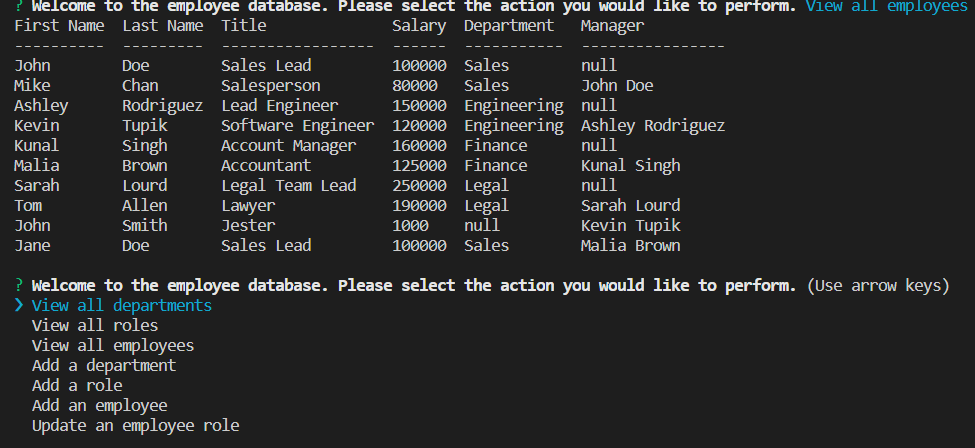

  # Employee Tracker

  

  ## Table of Contents:

  * [Description](#Description)

  * [Installation](#Installation)

  * [Usage](#Usage)

  * [Contributions](#Contributions)

  * [Test](#Tests)

  * [Email](#Questions)

  * [Github](#Questions)

  ## Description: 
  This project uses sql to produce of database of employees, then uses javascript and inquierer to update the database through the node cli

  ## Installation: 
  This project requires Node, Inquirer, and Console.table
  
  ## Usage: 
  this project requires a connection to a MYSQL database

  ## License:
  none 
  

  ## Contributions: 
  No contributions needed

  ## Tests: 
  No testing needed

  ## Questions:

  [Email](mailto:gabeab34@gmail.com)

  [GitHub](https://github.com/gabeab34)

